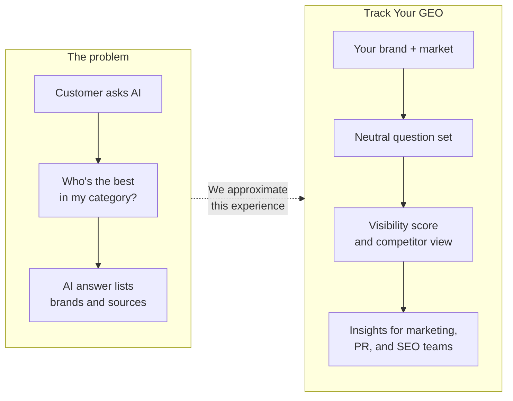
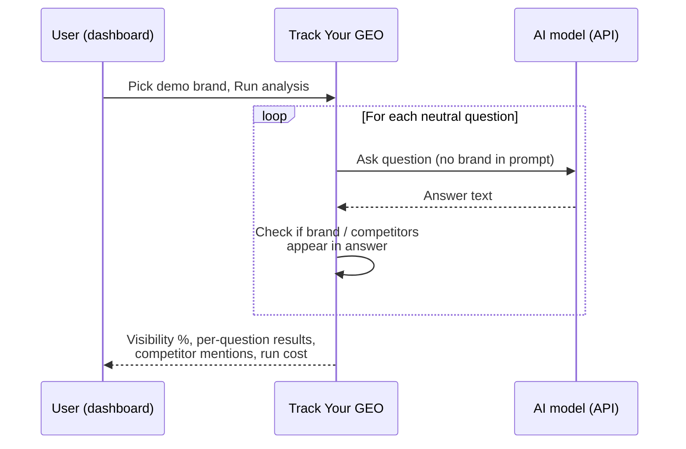

# Track Your GEO — prototype

**Track Your GEO** helps brands see how often they appear when people ask AI assistants industry-style questions (for example, “best Indian restaurant in London”) — and how that compares to named competitors.

This repository holds a **local prototype**: a working demo that runs on a laptop, not a live customer product. It uses built-in demo companies, simulated AI Q&A, and a simple visibility score. Full product vision and personas are in [product_brief.md](product_brief.md).

---

## What this prototype does today

- Pick a **demo brand** (e.g. **Dishoom** in London, **Clio** in the UK) from a web dashboard.
- Run a batch of **neutral questions** — the brand name is **not** baked into the question text, so answers are not artificially steered toward one name.
- For each answer, check whether your brand (and competitors) **appear in the text**.
- See a **visibility percentage**, a per-question breakdown, competitor mentions, and approximate **API cost** for the run.

Runs are saved locally so you can compare results across sessions on the same machine.

## How the product is meant to work

Customers increasingly discover brands through **generative AI** (ChatGPT, Claude, Gemini, and similar tools) rather than only through traditional search. Track Your GEO is meant to give marketing, comms, and SEO teams a clear picture of **AI visibility**: where they show up, where they do not, and what to improve — without opaque consultancy-style reporting.



## How an analysis run works

When someone clicks **Run analysis** in the dashboard:

1. The tool loads the demo brand’s question set and competitor list.
2. For each **neutral** question, it asks a configured **AI model** (via API).
3. It records each answer and checks whether the brand name and competitor names appear in the text.
4. It calculates **visibility** = the share of answers that mention your brand.
5. The dashboard shows the score, each question/answer pair, and competitor hits.



## Understanding the score

**Visibility** here means: *of the neutral questions we asked, in how many answers does the brand name appear?* (matched as plain text in the reply, case-insensitive).

That is useful for **trends and comparisons** (your brand vs competitors, or this run vs a later run) inside the tool. It is **not** the same as logging into consumer ChatGPT with web search and checking what one user sees — models, browsing, region, and UI all differ. See [docs/geo-scoring-realism.md](docs/geo-scoring-realism.md) for an honest comparison and how we might improve fidelity over time.

## Product journeys: vision vs this prototype

From [product_brief.md](product_brief.md):

| Journey | What it is | In full product vision | In this prototype |
|--------|------------|------------------------|-------------------|
| **1** | Discover AI visibility | Yes | **Yes** — score, probe list, summary |
| **2** | Diagnose performance gaps | Yes | **Yes** — per-question table, competitor mentions |
| **3** | Tailor dashboard (custom queries, data sources) | Later | **No** |
| **4** | Take action (prioritised recommendations) | Yes | **Not yet** — recommendations are paused in this build |
| **5** | Monitor progress over time | Later | **No** — no history/trends UI |
| **6** | Report internally (export, share) | Later | **No** |

## Try the demo

**Live prototype:** [https://track-your-geo.vercel.app/](https://track-your-geo.vercel.app/)

You need a developer (or someone comfortable with a terminal) to start the app once per machine for **local** use. After that, anyone can use the browser UI:

1. Open the dashboard (usually `http://localhost:5173`).
2. Choose a **demo brand** from the dropdown.
3. Click **Run analysis** and review visibility, each Q&A, and competitors.

Built-in demos are defined in code ([`hardcoded_pilots.py`](apps/api/tygeo/hardcoded_pilots.py)) — **Dishoom** (London), **Clio** (UK legal tech), and **SDL Surveying** (UK residential surveys). Setup steps are under [For developers](#for-developers) below.

Each run uses your **OpenAI API key** (or another configured provider) and incurs a small per-question cost; the UI shows approximate spend for the run.

## Learn more

| Topic | Document |
|--------|----------|
| Product vision, users, MVP scope | [product_brief.md](product_brief.md) |
| Score vs real ChatGPT-style search | [docs/geo-scoring-realism.md](docs/geo-scoring-realism.md) |
| Recent decisions and next steps | [docs/worklog/](docs/worklog/) |

---

## For developers

Local-only stack: **FastAPI** API + **Vite/React** UI. Demo brands are hardcoded in [`apps/api/tygeo/hardcoded_pilots.py`](apps/api/tygeo/hardcoded_pilots.py). Human–agent workflow (orient, plan, approve, validate, worklog): [AGENTS.md](AGENTS.md).

### Prerequisites

- **Python 3.11+** (3.12+ recommended)
- **Node.js 20+** for the web UI and OpenSpec CLI (OpenSpec officially wants Node 20.19+)
- An **OpenAI API key** (or configure another provider supported by LiteLLM in code)

### Quick start (Windows)

From the repository root:

1. Create a virtual environment and install the app (example uses `tygeo-venv`):

```powershell
python -m venv tygeo-venv
.\tygeo-venv\Scripts\python.exe -m pip install -U pip setuptools wheel
.\tygeo-venv\Scripts\pip.exe install -e ".[dev,eval]"
```

2. Configure environment:

```powershell
Copy-Item .env.example .env
# Edit .env: set OPENAI_API_KEY; probes use TYGEO_PROBE_MODEL (default gpt-4o-mini-search-preview)
```

3. Start the API (terminal A), from repo root:

```powershell
.\tygeo-venv\Scripts\uvicorn.exe tygeo.main:app --reload --host 127.0.0.1 --port 8000
```

4. Install and start the web UI (terminal B):

```powershell
cd apps\web
npm install
npm run dev
```

5. Open the URL printed by Vite (usually `http://localhost:5173`), pick a **demo brand** from the dropdown, optionally override brand/location, and click **Run analysis**.

Alternatively run both processes using [scripts/dev.ps1](scripts/dev.ps1).

If the web UI shows proxy errors right after startup, wait a few seconds for the API to finish booting and refresh.

### Repository layout

| Path | Purpose |
|------|---------|
| [apps/api/tygeo/](apps/api/tygeo/) | FastAPI app, LiteLLM calls, SQLite persistence; built-in demo brands live in [`hardcoded_pilots.py`](apps/api/tygeo/hardcoded_pilots.py) |
| [apps/web/](apps/web/) | Vite + React dashboard |
| [pilot/](pilot/) | Optional folder for future YAML pilots; the prototype **does not** read YAML from here today |
| [openspec/](openspec/) | OpenSpec specs and change proposals |
| [eval/](eval/) | Pytest + DeepEval checks |
| [docs/geo-scoring-realism.md](docs/geo-scoring-realism.md) | Limits of the prototype score vs real assistant search; ways to improve fidelity |
| [docs/worklog/](docs/worklog/) | Session summaries and suggested next steps |
| [product_brief.md](product_brief.md) | Product context |
| [AGENTS.md](AGENTS.md) | Agent/human collaboration workflow |

### OpenSpec

This repo uses [Fission-AI OpenSpec](https://openspec.dev/). Slash commands live under `.cursor/commands/` (for example `/opsx:propose`). After pulling changes, restart Cursor so commands register.

### Evaluation (DeepEval + pytest)

```powershell
.\tygeo-venv\Scripts\pytest.exe eval -q
```

DeepEval is used for a **deterministic substring metric** on golden snippets (no extra LLM calls in that test). Add API-based metrics later as prompts stabilize.

### uv (optional)

If you use [uv](https://github.com/astral-sh/uv): `uv sync` then `uv run pip install -e ".[dev,eval]"` is not needed — use `uv sync --extra dev --extra eval` once `uv` supports extras on your machine.

### Data

SQLite database file defaults to `./data/tygeo.db` (created on first run). Add `data/` to backups if you care about historical runs.

---

## Deployment

Production layout: **Vercel** serves the static React app; the browser calls **Railway** (FastAPI) directly. SQLite lives on a Railway volume so run history survives redeploys.

### Environment variables

| Variable | Where | Value |
|----------|-------|-------|
| `OPENAI_API_KEY` | Railway | Your OpenAI API key |
| `TYGEO_ALLOWED_ORIGINS` | Railway | `https://<your-app>.vercel.app` (comma-separated if multiple) |
| `TYGEO_DATABASE_URL` | Railway | `sqlite:////data/tygeo.db` |
| `TYGEO_MODEL` | Railway | `gpt-4o-mini` (default) |
| `TYGEO_PROBE_MODEL` | Railway | `gpt-4o-mini-search-preview` (default) |
| `VITE_API_URL` | Vercel | `https://<your-app>.up.railway.app` |

Locally, leave `VITE_API_URL` unset so the Vite dev proxy handles `/api` requests.

### Railway (backend)

1. [railway.app](https://railway.app) → **New Project** → Deploy from GitHub.
2. Set **Root Directory** to `apps/api`.
3. Add environment variables from the table above. For the first deploy, set `TYGEO_ALLOWED_ORIGINS=*` until you have the Vercel URL.
4. Add a **Volume** mounted at `/data`.
5. Confirm health: `GET https://<app>.up.railway.app/api/health` → `{"status":"ok"}`.

Config files: [`apps/api/railway.json`](apps/api/railway.json), [`apps/api/nixpacks.toml`](apps/api/nixpacks.toml).

### Vercel (frontend)

1. [vercel.com](https://vercel.com) → **New Project** → Import the GitHub repo.
2. Set **Root Directory** to `apps/web`.
3. Build command: `npm run build`; output directory: `dist`.
4. Set `VITE_API_URL` to your Railway URL (no trailing slash).
5. Deploy and confirm the pilots list loads.

### After both are live

1. Update Railway `TYGEO_ALLOWED_ORIGINS` to your real Vercel URL (replace `*`).
2. Redeploy Railway.
3. Run a full analysis from the Vercel URL and check the browser console for CORS errors.
4. Redeploy Railway once more and confirm prior run history still appears (volume persistence).
